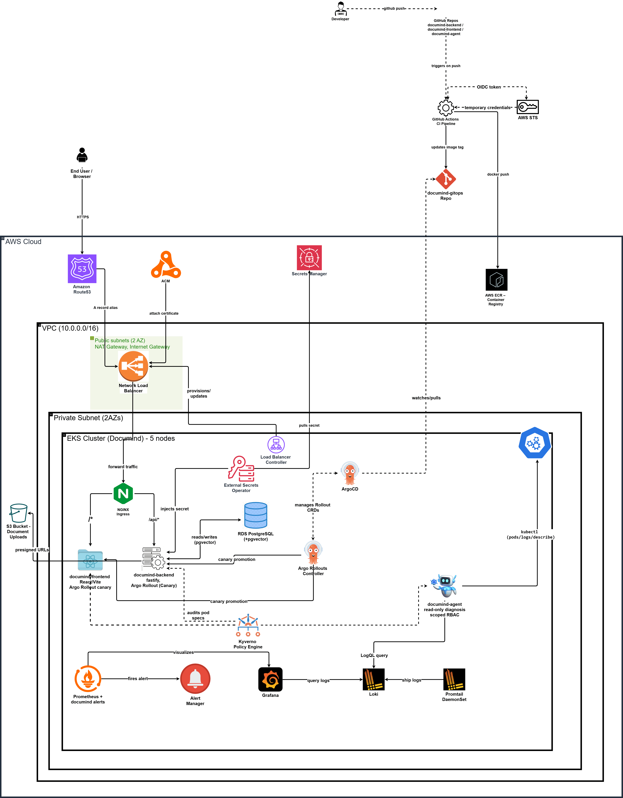

# DocuMind - AI Platform on AWS/EKS

DocuMind is a platform engineering project disguised as a document Q&A app. Under the hood it's a full AWS/EKS stack - Terraform, GitOps, canary rollouts, observability, policy enforcement - built to mirror how a real infra team operates, not just to ship a feature.

The AI application itself (upload a document, ask questions about it) is
intentionally the _smaller_ half of this project. The larger goal was building
and operating the same class of infrastructure a real platform team runs:
Terraform-managed AWS resources, GitOps-driven deployments, progressive delivery,
observability, policy enforcement, and a genuinely working CI/CD pipeline -
plus a from-scratch agentic AI feature that uses that infrastructure.

---

## Architecture

See the architecture diagram below for the full component breakdown and data flow.

## Repositories

| Repo                                                             | Purpose                                                              |
| ---------------------------------------------------------------- | -------------------------------------------------------------------- |
| [documind-infra](https://github.com/qezman/documind-infra)       | Terraform - all AWS infrastructure                                   |
| [documind-gitops](https://github.com/qezman/documind-gitops)     | Kubernetes manifests + ArgoCD Applications                           |
| [documind-backend](https://github.com/qezman/documind-backend)   | Fastify API - auth, document upload, RAG chat                        |
| [documind-frontend](https://github.com/qezman/documind-frontend) | React/Vite frontend                                                  |
| [documind-agent](https://github.com/qezman/documind-agent)       | AI diagnostic agent - read-only Kubernetes troubleshooting assistant |

---

## What's actually built

### Infrastructure (Terraform)

- VPC with public/private subnets across 2 AZs, NAT Gateway, proper route tables
- EKS cluster (managed node group, 5 nodes)
- RDS PostgreSQL with `pgvector` for embeddings
- S3 for document storage
- IRSA (IAM Roles for Service Accounts) - every component that talks to AWS
  (backend, External Secrets, Load Balancer Controller, EBS CSI driver, CI/CD)
  has its own narrowly-scoped IAM role, not a shared one
- Route53 + ACM - real domain, real TLS, terminated at an AWS Network Load Balancer
- AWS Load Balancer Controller (the modern replacement for the legacy in-tree
  provider, required for correct NLB + TLS behavior)
- EBS CSI driver (with its own IRSA role) - dynamic volume provisioning for
  anything needing persistent storage

### Platform layer (Helm, via Terraform)

- **ArgoCD** - GitOps: every application is declared in `documind-gitops` and
  continuously reconciled, including self-healing if the live cluster drifts
  from what's declared in Git
- **External Secrets Operator** - real secrets (DB credentials, API keys) live
  in AWS Secrets Manager and sync into Kubernetes Secrets automatically; nothing
  sensitive is ever committed to a repo
- **Kyverno** - policy enforcement (disallow root containers, restrict image
  registries to approved sources), applied cluster-wide via GitOps
- **Prometheus + Grafana + Alertmanager** (`kube-prometheus-stack`) - metrics,
  dashboards, and a custom alert rule for backend downtime/crash-looping
- **Loki + Promtail** - centralized log aggregation across all pods, queryable
  from Grafana
- **Argo Rollouts** - canary deployments instead of instant swaps; both backend
  and frontend roll out in weighted steps (25% → 50% → 100%) with pauses
  between, so a bad deploy affects a fraction of traffic before going further

### CI/CD

- GitHub Actions, authenticated to AWS via OIDC federation - no stored AWS
  access keys anywhere in either app repo
- On push to `main`: build the Docker image, tag it with the commit SHA, push
  to ECR, then commit that new tag into `documind-gitops` - which ArgoCD picks
  up automatically and rolls out via the canary strategy above
- Full loop: `git push` → built, deployed, and live, with zero manual steps

### The AI application

- Document upload → chunking → embedding (Gemini) → stored in `pgvector`
- Chat interface that retrieves relevant chunks and answers questions grounded
  in the uploaded document
- JWT-based auth, registration/login

### The agentic feature - `documind-agent`

A standalone diagnostic microservice with its own scoped-down RBAC identity
(read-only, limited to pods/logs in one namespace). Given a plain-English
question, it uses Gemini's function-calling to decide which real, live
Kubernetes tools to call (`kubectl get pods`, `describe pod`, `logs`, Loki
queries), executes them against the actual running cluster, and returns a
grounded diagnosis - not a canned response. During development, it correctly
diagnosed a real cluster issue (pod scheduling failure due to per-node pod
capacity) on its first meaningful test.

See [documind-agent's README](https://github.com/qezman/documind-agent) and
[Walkthrough.md](./Walkthrough.md) for more detail and screenshots.

---

## Design Decisions & Tradeoffs

- **Loki, single-binary mode** - one pod, one PVC, simple to run. At real log volume you'd move to distributed mode with S3-backed storage instead.
- **One IAM role per component (IRSA)** - backend, External Secrets, LB Controller, EBS CSI, and GitHub Actions each get their own scoped role. More roles to manage, but a compromised component can't borrow another's permissions.
- **Canary via Argo Rollouts, 2 replicas** - traffic shifts 25% → 50% → 100% with pauses in between, so a bad deploy gets caught before it's fully live. With only 2 pods the percentages are coarse; real granularity needs more replicas (and an HPA, which isn't wired up yet).
- **GitOps, not direct** `kubectl apply` - CI only ever updates the `documind-gitops` repo; ArgoCD applies it. Slower than a direct deploy, but one auditable source of truth, and the cluster self-heals if anyone edits it by hand.
- **Secrets in AWS Secrets Manager via External Secrets** - nothing sensitive lives in git. Tradeoff: if the `ExternalSecret` or its IAM role is misconfigured, the pod has _no_ secret and fails to start, rather than quietly running on a stale one.
- **Migrations run by hand (**`psql`**)** - no automated migration job yet. Fine for now; a real gap versus a proper CI/CD migration step.
- **Kyverno in Audit mode** - policies report violations without blocking anything. Safer to roll out this way, but nothing's actually enforced yet.
- **Agent is read-only** - RBAC only allows `get`/`list` on pods and logs, nothing else. Zero blast radius if it misbehaves, but it can only diagnose, never fix - a human still acts on what it finds.
- **AWS Load Balancer Controller, not the legacy in-tree provisioner** - needed for the NLB + TLS setup to work correctly on EKS. One more controller and IAM role to run, but it's the path that actually works.

## Documentation

Full setup guide, architecture decisions, and redeployment walkthrough:

[AI Platform on AWS/EKS](https://app.notion.com/p/DocuMind-EKS-Platform-Walkthrough-3bb604d0a689801db9e4fb5e0b1f77c7)

Alternative, see [Walkthrough.md](./Walkthrough.md) for the full build order, including
the exact sequence infrastructure gets applied in. Known issues and their
fixes are kept separately in [GOTCHAS.md](./GOTCHAS.md).
